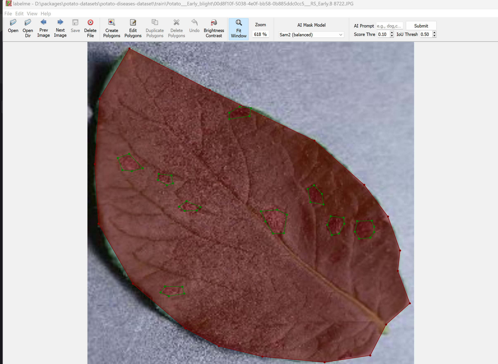

# Potato Diseases Dataset
https://github.com/jnai-team/potato-diseases-dataset

<!-- http://114.242.12.42:3000/hailiang-wang/potato-diseases-dataset/ -->

马铃薯病害数据集：通过叶片识别早疫病、晚疫病和健康叶片。



## Data labels

### Image classification

每个文件夹一个分类。

| Chinese | English |
| --- | --- |
| 早疫病 | [Potato___Early_blight](./data/Potato___Early_blight) | 
| 晚疫病 | [Potato___Late_blight](./data/Potato___Late_blight) | 
| 健康 | [Potato___healthy](./data/Potato___healthy) | 

> 命名方式和数据集 PlantVillage 中马铃薯叶片名称一致。https://www.kaggle.com/datasets/emmarex/plantdisease 

### Instance segment

使用了 Labelme 标注了实例分割信息。
每个图片文件，其标注文件是同名的 JSON 文件，比如 `train/Potato___healthy/ff700844-68ad-4e99-8427-58a39c07f817___RS_HL 1860.JPG` 图片的 LabelMe 标注文件是 `train/Potato___healthy/ff700844-68ad-4e99-8427-58a39c07f817___RS_HL 1860.json`。

标签：

| 字段 / Label	| 描述 / Description | 
| --- | --- |
| healthleaf	| 健康叶片边缘 / Health Leaf | 
| zybleaf	| 早疫病边缘 / Early Blight Leaf | 
| zybspot	| 早疫病病害部分 / Early Blight Lesion Location |
| wybleaf	| 晚疫病边缘 / Late Blight Leaf |
| wybspot	| 晚疫病病害部分 / Late Blight Lesion Location | 

## Data size

All images are in 256x256 pixels, RGB.

### Train data

Folder - [train](./train/)

| Category | Size |
| --- | --- |
| **Potato___Early_blight** | 3,615 | 
| **Potato___Late_blight** | 2,424 | 
| **Potato___healthy** | 1,172 | 

Total -  7,211 pics.

### Test data

Folder - [test](./test/)

| Category | Size |
| --- | --- |
| **Potato___Early_blight** | 363 | 
| **Potato___Late_blight** | 67  | 
| **Potato___healthy** | 363 | 

Total - 793.

## Sources

本数据集经由多个相关数据集汇总而来。

### Train data

* PlantVillage：https://github.com/spMohanty/PlantVillage-Dataset
* 实地采集：在马铃薯农田中，拍摄病害区域。
* 网络数据集研判和整理：
    * [datasets/rizwan123456789](https://www.kaggle.com/datasets/rizwan123456789/potato-disease-leaf-datasetpld): 马铃薯病害数据集（健康早晚疫病）带部分标签 <!-- 这个数据集就是 https://download.csdn.net/download/qq_45671994/88054414 -->

### Test data

* **Potato___Late_blight** and **Potato___healthy** are from [nirmalsankalana/potato-leaf-healthy-and-late-blight](https://www.kaggle.com/datasets/nirmalsankalana/potato-leaf-healthy-and-late-blight)
* **Potato___healthy** is combined by multi sources
    * 实地采集：在马铃薯农田中，拍摄病害区域。
    * PlantVillage
    * [datasets/rizwan123456789](https://www.kaggle.com/datasets/rizwan123456789/potato-disease-leaf-datasetpld)

## BibTeX Citation

```
@online{dataset:potatowhl202503,
  author = {Hai Liang Wang, Hong Zhi Zhang},
  title = {Potato Diseases Dataset},
  year = 2025,
  url = {https://github.com/jnai-team/potato-diseases-dataset},
  urldate = {2025-03-24}
}
```

## License

[Community Data License Agreement – Permissive – Version 1.0](./LICENSE)

More explanations in Chinese - [社区数据许可协议 - 许可 - 版本1.0](https://www.oschina.net/translate/cdla-introduction?cmp)
